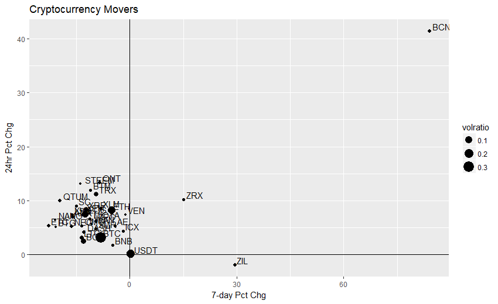
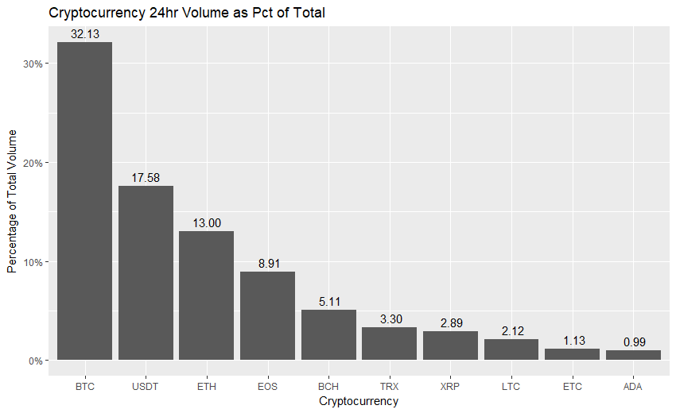

# CoinMarketCap
The code below is a rather simple use of the CoinMarketCapR package that I have found quite useful in quickly gauging market dynamics. The first is a classic X/Y graph of Cryptocurrency movers with the size of the data point representing that coins percentage of total 24hr volume. The second chart displays the top 10 coins ordered by their share of volume over the most recent 24Hr period.

